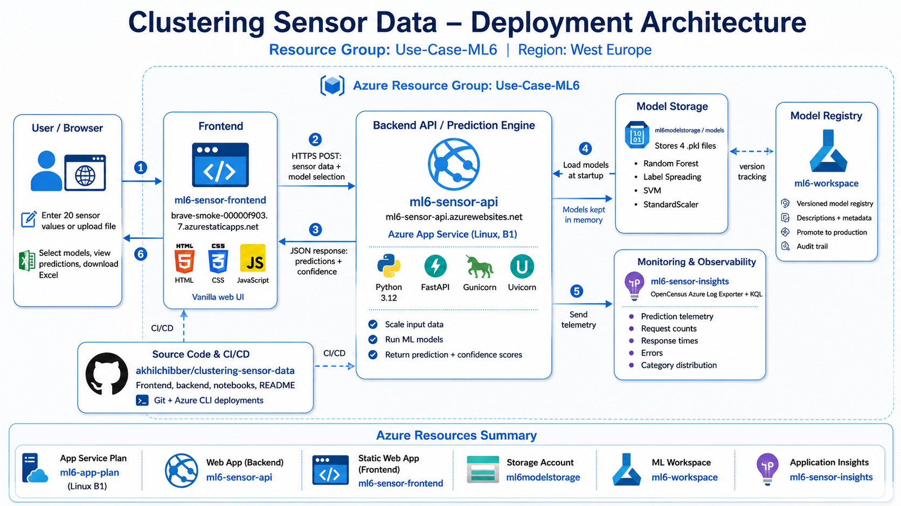

# Clustering Sensor Data - Use Case 1

<p align="center">
  
</p>

## Problem

A machine has 20 sensors recording data during breakdowns. I have 1600 breakdown records. Experts manually labeled only 40 of these into 3 categories which are possibly the reasons for breakdown. The goal is to use those 40 labels to classify the remaining 1560 breakdowns into the same 3 categories.

## Approach

I started by trying unsupervised clustering (K-Means and DBSCAN) to see if the data naturally separates into groups. It didn't as both methods put the entire dataset into 1 or 2 clusters, which made me realize that out data doesn't have obvious clusters. This made me think that I need to use the 40 expert labels as part of a supervised clustering / supervised classification.

I then moved to semi-supervised clustering using Label Spreading, for using 40 known labels to predict the 1560 unknown points. I did hyperparameter tuning using Label Spreading Algorithm and got an maximum accuracy of 55%. To increase the accuracy, considering we only have 40 labeled dataset which is quite low, I thought to create some synthetic data for all the three labels which I did using SMOTE synthetic data augmentation which increased the accuracy to 77.5% by having 200 data points per class. I also tried PCA to reduce 20 sensors to fewer features, but found all sensors contribute equally, so PCA didn't help.

As I was already doing a Semi-Supervised Clustering, I thought why not give it a try to also go for a Supervised Classification using a few methods including (i) Random Forest and Support Vector machine. Considering, I wanted to unnderstand which model is the best, I compared 3 models side by side including (i) Label Spreading, (ii) Random Forest, and (iii) Support Vector Machine. 

## Key Design Decisions

1. **Model Evaluation:** I used K-Fold Cross-Validation on the 40 real labels (hide 1, train on 39, repeat 40 times) for model evaluation where the final accuracy was an average of the accuracy of all the iterations.
2. **SMOTE only for Label Spreading:** Without using any synthetic data Random Forest achieved 70% accuracy while SVM achieved 55% accuracy. When SMOTE was applied to Random Forest and SVM, they immediately hit 100% accuracy which made me think that it is a clear sign of overfitting. So, I decided to add synthetic data just for Label Spreading Clustering and not for Random Forest and Support vector Machine.
3. **Random Forest as the Winner:** Considering I have not used any synthetic data in Random Forest model training, I do feel the 70% accuracy Random Forest Model is better than the 77.5% accuracy Label Spreading Clustering model is considering the confidence score in the final predictions is also the highest using Random Forest Algorithm.

## Assumptions and Tradeoffs

- The 40 expert labels are assumed to be correct which showcases 3 reasons for the breakdown of machine.
- There is no ground truth for the 1560 predictions, so we are dependent on confidence scores top evaluate the performance of our ml models.

## What I Would Improve With More Time

- Request more expert labels.
- Add synthetic data using SMOTE without including the 1 labeled data which we need to test for evaluating the accuracy.
- Try Self-Training Classifier like Random Forest in which we can iteratively label confident points and retrain which can lead to more labeled data, ofcourse it is based on the assumption that the predicted labels are going to be accurate.
- Explore feature engineering e.g. sensor ratios, interactions, etc. to create more features to train the model.
- Build an ensemble that combines predictions from all 3 models to give one prediction using a voting mechanism.

## Folder Structure

```
Take-Home-Assignment/
├── README.md                          - You are here
├── data_sensors.csv                   - Input dataset (1600 × 21)
├── Take-Home-Assignment.pdf           - Take Home Assignment (THA)
├── UML_Diagram.png                    - Model Training Architecture Diagram
├── Deployment-Architecture.png        - Model Deployment Architecture Diagram
├── Multi_Sensor_Classification.ipynb  - Jupyter Notebook for Model Training
├── K_Means.ipynb                      - Experiment: Unsupervised Clustering using K-Means
├── DBSCAN.ipynb                       - Experiment: Unsupervised Clustering DBSCAN
├── PCA_Clustering.ipynb               - Experiment: Using PCA to Reduce Features
├── models/                            - Saved Trained Models (.pkl)
│   ├── random_forest_model.pkl        
│   ├── label_spreading_model.pkl
│   ├── svm_model.pkl
│   └── scaler.pkl                     - Required to Normalize new dataset
├── predictions/                       - Output predictions for 1600 points
│   ├── random_forest_predictions.csv  
│   ├── label_spreading_predictions.csv
│   └── svm_predictions.csv
├── backend/                           - Backend FastAPI Endpoint
│   ├── app.py                         
│   └── requirements.txt               
└── frontend/                          - Frontend
    ├── index.html                     
    ├── styles.css                     
    ├── app.js                         
    └── config.js                      
```

## How to Run

Open `Multi_Sensor_Classification.ipynb` in Google Colab and run all cells. It will train all 3 models, perform model evaluation, confidence score calculation, and save the trained model as .pkl file which will be used in the next section as part of Model Deployment.

## ML Model Deployment Architecture



After training, I deployed our three trained models as a live prediction service on Azure. The backend is a FastAPI application hosted on Azure App Service that loads our three trained models from Azure Blob Storage when it starts up. Once loaded, the models stay in memory sfor performing predictions. The frontend is a HTML/CSS/JS page hosted on Azure Static Web Apps where users can enter 20 sensor values manually or upload a CSV/Excel file, select which model to use, and get predictions along with their confidence scores. The frontend calls the backend API over HTTPS. Every prediction is logged to Azure Application Insights for monitoring so we can see which models are being used, average confidence levels, and any possible errors if any. The models are also registered in Azure ML Model Registry for version tracking. No credentials were stored in the frontend code, the Blob Storage connection string was securely stored as an Azure App Service environment variable.

**Live URLs:**
1. Frontend: https://brave-smoke-00000f903.7.azurestaticapps.net
2. Backend API: https://ml6-sensor-api.azurewebsites.net/docs
